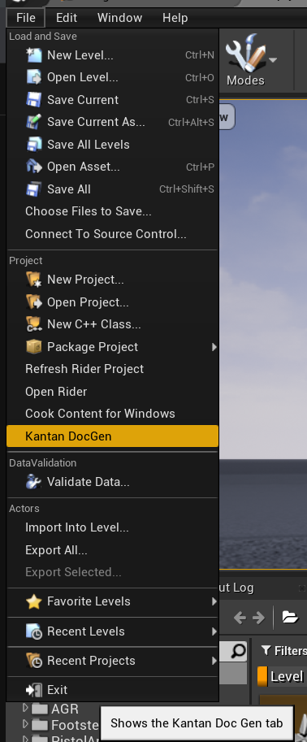
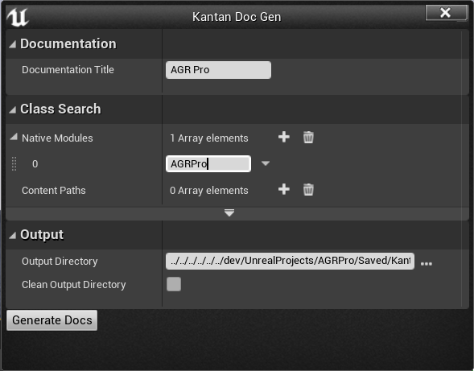

## AGRPro documentation

This repository holds the source files used to generate AGRPro plugin documentation.

It uses Gatsby to generate a static website based on [@rocketseat/gatsby-theme-docs fork](https://github.com/mklabs/gatsby-themes/tree/main/%40rocketseat/gatsby-theme-docs) gatsby plugin and theme.

The API generated from the plugin source for all Blueprint exposed UPROPERTIes and UFUNCTIONs is done using [KantanDocGenPlugin](https://github.com/kamrann/KantanDocGenPlugin), but using a [fork](https://github.com/mklabs/KantanDocGenPlugin) of it to accommodate our need to support UPROPERTY for variables and BlueprintAssignable events for components.

## Install

To run the website locally, you'll need [nodejs](https://nodejs.org/en/) installed on your machine. Once done, run:

```
npm install
npm run dev
```

## Generate API documentation

First, you'll need to install [KantanDocGenPlugin fork](https://github.com/mklabs/KantanDocGenPlugin) in your local AGRPro host project Plugins' folder.

From within your development project for AGR Pro

```
git clone https://github.com/mklabs/KantanDocGenPlugin.git Plugins/KantanDocGenPlugin
```

Then open up the project and enable KantanDocGenPlugin plugin, then recompile the project (or restart the editor directly, on first clone Unreal will ask you to build the modules when the plugin is enabled)

Once enabled, open up Kantan DocGen from the File menu



and configure the Kantan DocGen window like so:



and hit `Generate Docs`. When the documentation generation is done, you'll be able to find generated XML files in `Saved/KantanDocGen` (the one that we'll work with) and generated HTML files in `Intermediate/KantanDocGen` (we won't use them but you can still take a look)

To bring these generated API XML files into this Gatsby repo:

1. First, make sure to edit `gatsby-config.js` file and adjust the `HOST_PROJECT` property to point to your local folder for AGRPro dev project.
2. Then, you can use `scripts/api.js` by running `npm run update-api`
3. rerun gatsby with `npm run dev` to see the result

## Other documentation

You'll find source files for documentation as `mdx` file (basically Markdown files with React capabilities) in `src/docs`

You'll find `sidebar.yml` in `src/config` which dictates the sidebar content.

You'll find generated API XML file in `src/AGRProAPI` which the target directory when you run `npm run update-api`

You'll find `404.js` file in the `src/pages` folder.

Every other folder in `src/` are used by Gatsby and the custom theme to generate the website and shouldn't be modified (unless you know what you're doing ;))

## Have fun

<3