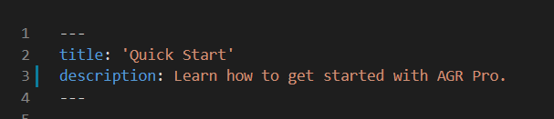
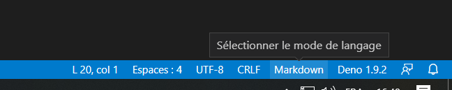

Add quick start documentation page here. If you need any images, you can include them in this folder and use them with the following syntax

```markdown

```


If you're using Visual Studio, I would recommend you install and use [VSCode Paste Image](https://marketplace.visualstudio.com/items?itemName=mushan.vscode-paste-image)

and also configure `.mdx` extension to be recognized as Markdown in VS Code.

In the bottom left:



*"Selectionner le mode de langage" basically means "Select language mode"* You can configure filetype extension for all the mdx files from there.